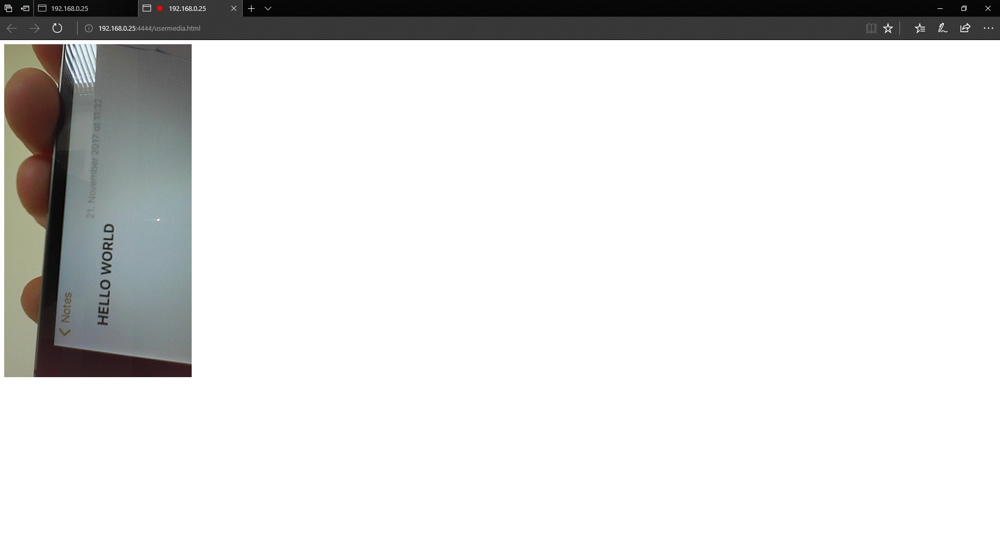
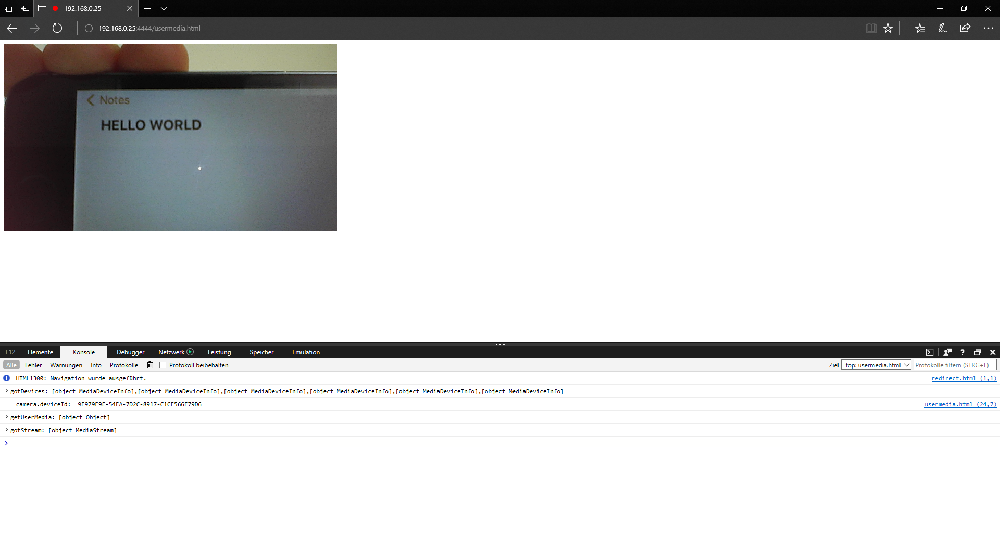

# edge90

An example repository for reproducing a curious bug.

1. Click on an href with `target="_blank"`
2. which results in a redirection (Moved Permanently 301) to
3. a page requesting the users _internal_ camera (`getUserMedia`)
4. the resulting camera image is rotated by 90°:



vs expected result:



Browser affected:

* Microsoft EdgeHTML 16.16299
* Microsoft Edge 41.16299.15.0

## Other details

- Not reproducible with external camera.
- Not reproducible when opening the link in the same tab.
- Not reproducible when opening the link in a different tab without redirection.

## server.py

I've provided a simple server which provides a 301 when visiting
the `/redirect.html` path.

```bash
python server.py
```

Note that I'm binding to my local IP since I'm not on a windows machine.
